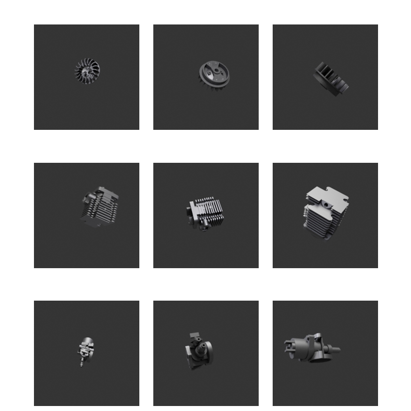
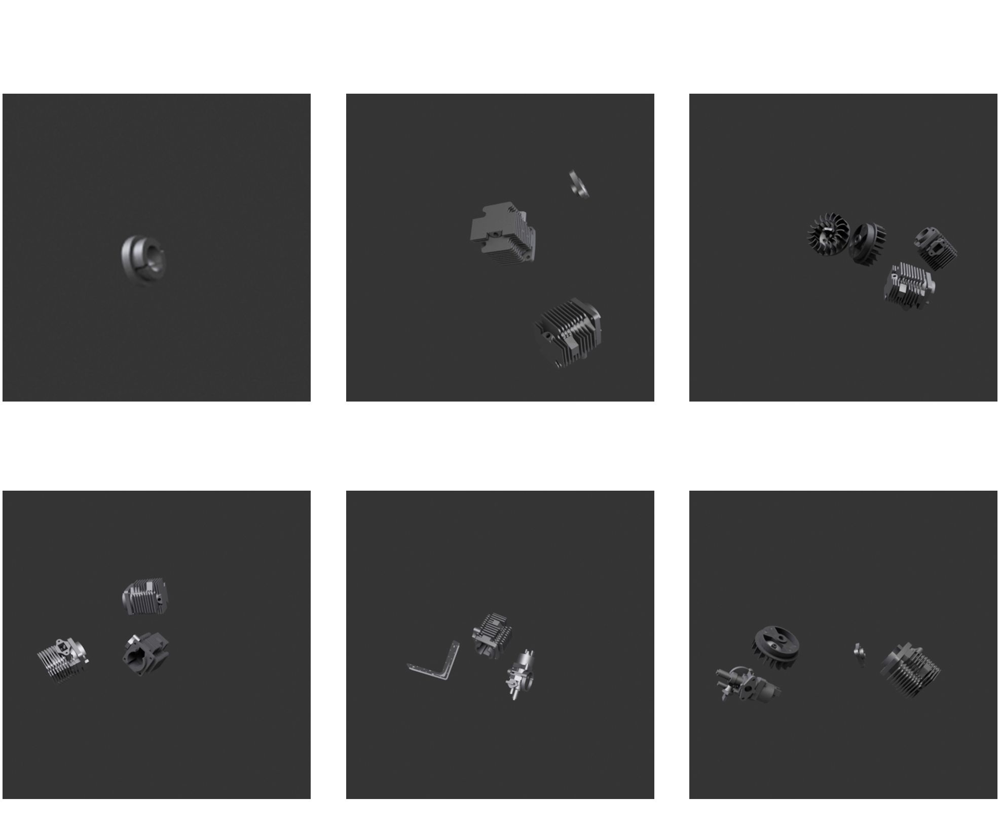
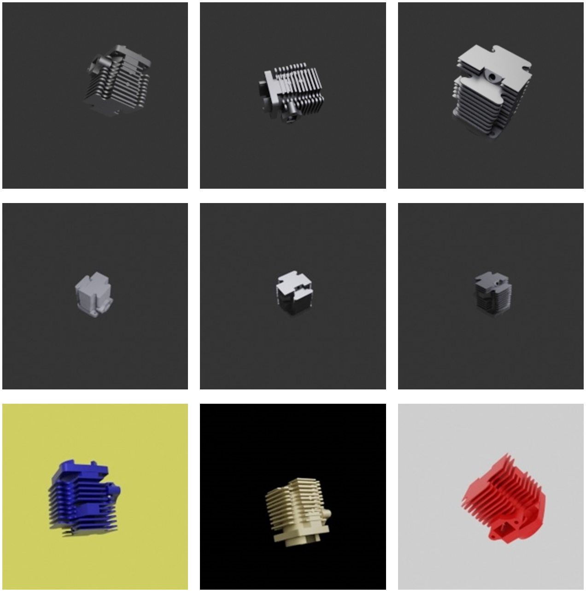
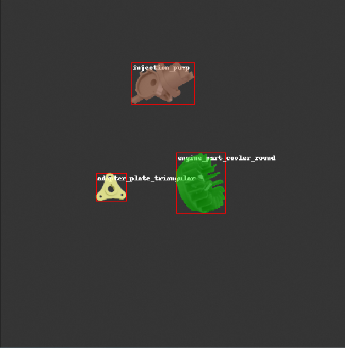
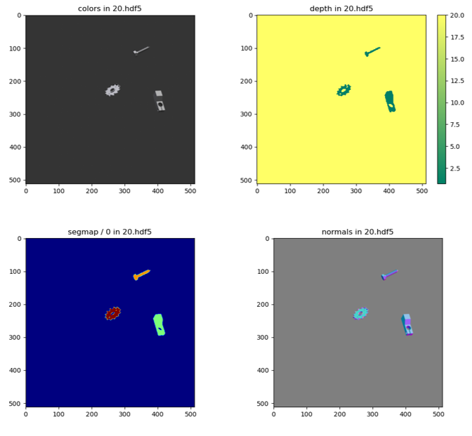

# SynthiCAD


## _Synthetic Data Generation Tool_

SynthiCAD is a python scripted tool that can automatically generate diverse and realistic labelled synthetic data from 3D object models, which can be used for a range of computer vision tasks such as classification, object detection, semantic segmentation, and instance segmentation. The tool simplifies the image rendering by linking a programmable interface to Blender rendering engine, which provides access to essential rendering parameters. The tool utilizes BlenderProc, a python library which enables customized scripting using Blender’s internal data structures through Blender Python API.

### Basic Structure

- Initialization of tool 
- Loading specified object and instances 
- Setting up lighting based on user input
- Configuring the camera positions and settings
- Manipulating object and properties poses with collision checks
- Rendering frames in consideration with rendering checks
- Saving generated images in COCO/.HDF5 format with annotations

### User Configuration Settings

The repository contains a configuration file **"Config.JSON"** that allows the user to specify the necessary settings for image generation. The configuration file contains various settings such as object selection, object placement and rotation, object color and metallic properties, number of objects and instances per image, output format, dataset split ratio, background, lighting properties, camera position, and resolution. The comments in the JSON file gives a detailed explanation or description of each user setting. Some of them are,

| Parameter | Description |
| ------ | ------ |
| num images | The number of images to generate in total |
| coco | Whether to use COCO format for output annotations |
| hdf5 | Whether to use HDF5 format for saving images and annotations |
| dataset split |Whether to split the dataset into training, validation, and testing sets|
| train percent | The percentage of images to use for training |
| val percent |The percentage of images to use for validation |
| test percent | The percentage of images to use for testing |
| img width | The width of the generated images in pixels |
| img height | The height of the generated images in pixels |
| light type | The type of light to use. Can be one of POINT, SUN, SPOT, or AREA |
| light color rgb | The RGB values for the light color |
| light energy | The energy level of the light |
| bg color rgb | The RGB values for the background color |
| obj color rgb | The RGB values for the object color |
| focus objects | Whether to focus on specific objects during image generation |
| focus obj | The objects to focus on during image generation |
| border threshold | The threshold value for setting border values |

### Sample Images from SynthiCAD

The following set of examples show the wide range of images generated by SynthiCAD, illustrating the diversity and variability in the generated outputs. Each example exhibits distinct variations in terms of object appearance, placement, orientation, lighting conditions, textures, and other visual attributes. These examples provide a comprehensive demonstration of the versatility and capability of SynthiCAD in generating images with different characteristics and qualities.

> The image set presented below displays three distinct objects with parametric variations in terms of location, rotation, light, and size.



> The image set below illustrates the variability in the number of objects and instances per generated image.



> The following image set showcases the diversity in lighting conditions, object colors, and background colors observed in each generated image.



### Installation

To install blenderproc is via pip:
```sh
pip install blenderproc
```
If you require modifications to the tool or wish to utilize the latest version available on the main branch, you can clone the repository:
```sh
git clone https://github.com/mbsa-tud/SynthiCAD.git
```
In order to enable the usage of the "blenderproc" command and have access to BlenderProc from any location on your system,
```sh
cd SynthiCAD

pip install -e .
```

### Usage

> Load all the CAD objects into the database in the following path: *<path to CAD objects>*

To utilize the Blender API, it is necessary to execute BlenderProc within the Blender Python environment. Consequently, instead of running your script using the standard Python interpreter, you must employ the command line interface provided by BlenderProc.

```sh
blenderproc run <your_python_script> <path to CAD objects> <path to output_dir>
```

It is recommended to execute a batch of multiple renders instead of rendering them all at once and to perform this task, users can use the batch file (**SynthiCAD.bat**) to run their script multiple times.

> Note: To enable GPU for faster rendering, the following line can be added to the script,
```sh
from blenderproc.python.renderer import RendererUtility

RendererUtility.set_render_devices(use_only_cpu: bool = False,
                                    desired_gpu_device_type: str | list[str] | None = None,
                                    desired_gpu_ids: int | list[int] | None = None)
```
parameters:
**use_only_cpu**           – If True, only the cpu is used for rendering.
**desired_gpu_device_type** – One or multiple GPU device types to consider. If multiple are given, the first available is used. Possible choices are ["OPTIX", "CUDA", "METAL", "HIP"]
**desired_gpu_ids**         – One or multiple GPU ids to specifically use. If none is given, all suitable GPUs are used.


> You can access the tool directly with default settings via the command:

```sh
blenderproc run code/main.py code/resources/Dataset/*.ply code/output
```


### Debugging via PyCharm

To enable debugging in PyCharm IDE, a new configuration based on Python Debug Server must be created, and
the pydevd-pycharm package must be installed in the Blender Python environment.

To create a new configuration based on Python Debug Server in PyCharm, follow these steps:

- Open PyCharm and navigate to "Edit configurations"
- Create a new configuration by selecting "Python Debug Server" as the base.

The configuration will provide you with specific instructions for your version, including the pip package to install and the code to add to your script.
Assuming you are using PyCharm 2021.3, you can follow these steps:

- Install the "pydevd-pycharm" package in Blender's Python environment using the following command:

```sh
blenderproc pip install pydevd-pycharm~=212.5457.59
```

- Add the following code to the top of your BlenderProc script, right after the imports:
```sh
import pydevd_pycharm
pydevd_pycharm.settrace('localhost', port=12345, stdoutToServer=True, stderrToServer=True)
```

- First, run your Python Debug Server configuration in PyCharm.

- Then, run your BlenderProc script as usual through the command line interface (CLI).

- PyCharm should enter debug mode, stopping at the next code line.

- You can now set breakpoints and step through the execution of your script.


### Visualization of Generated Data

##### COCO Annotations

To visualize the generated image along with COCO annotations, the following command can be used,
```sh
blenderproc vis coco [-i <image index>] [-c <coco annotations json>] [-b <base folder of coco json>]
```

Below is the example of coco annotations visualization:



##### HDF5 container

To visualize the contents in a hdf5 container, the following command can be used,
```sh
blenderproc vis hdf5 <path to .hdf5 file>
```
To enable the rendering of depth and normal maps along with RGB image, the following functions are to be called:

```sh
bproc.renderer.enable_depth_output(activate_antialiasing=False)
bproc.renderer.enable_normals_output()
```

Below are the example images that demonstrate the visualization of various rendered maps:



### Further Reference
Additional information and detailed explanations about the BlenderProc functions and Blender's internal functions used in the implementation can be found within their respective documentation.

| Documentation | Link |
| ------ | ------ |
| BlenderProc_ReadMe |https://dlr-rm.github.io/BlenderProc/# |
| Blender python API reference manual | https://docs.blender.org/api/current/index.html |

### Citation
```sh
@article{denninger2019blenderproc,
  title={BlenderProc},
  author={Denninger, Maximilian and Sundermeyer, Martin and Winkelbauer, Dominik and Zidan, Youssef and Olefir, Dmitry and Elbadrawy, Mohamad and Lodhi, Ahsan and Katam, Harinandan},
  journal={arXiv preprint arXiv:1911.01911},
  year={2019}
}
```

### Contribution

Want to contribute? Great!!! Pull requests are welcome.

## License

**Free Software, Hell Yeah!**

[//]: # (These are reference links used in the body of this note and get stripped out when the markdown processor does its job. There is no need to format nicely because it shouldn't be seen. Thanks SO - http://stackoverflow.com/questions/4823468/store-comments-in-markdown-syntax)

   [dill]: <https://github.com/joemccann/dillinger>
   [git-repo-url]: <https://github.com/joemccann/dillinger.git>
   [john gruber]: <http://daringfireball.net>
   [df1]: <http://daringfireball.net/projects/markdown/>
   [markdown-it]: <https://github.com/markdown-it/markdown-it>
   [Ace Editor]: <http://ace.ajax.org>
   [node.js]: <http://nodejs.org>
   [Twitter Bootstrap]: <http://twitter.github.com/bootstrap/>
   [jQuery]: <http://jquery.com>
   [@tjholowaychuk]: <http://twitter.com/tjholowaychuk>
   [express]: <http://expressjs.com>
   [AngularJS]: <http://angularjs.org>
   [Gulp]: <http://gulpjs.com>

   [PlDb]: <https://github.com/joemccann/dillinger/tree/master/plugins/dropbox/README.md>
   [PlGh]: <https://github.com/joemccann/dillinger/tree/master/plugins/github/README.md>
   [PlGd]: <https://github.com/joemccann/dillinger/tree/master/plugins/googledrive/README.md>
   [PlOd]: <https://github.com/joemccann/dillinger/tree/master/plugins/onedrive/README.md>
   [PlMe]: <https://github.com/joemccann/dillinger/tree/master/plugins/medium/README.md>
   [PlGa]: <https://github.com/RahulHP/dillinger/blob/master/plugins/googleanalytics/README.md>
